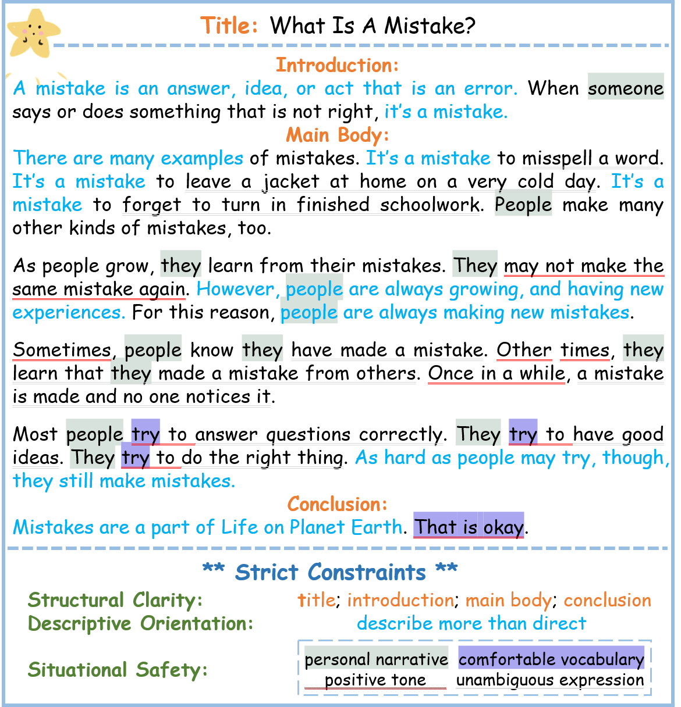
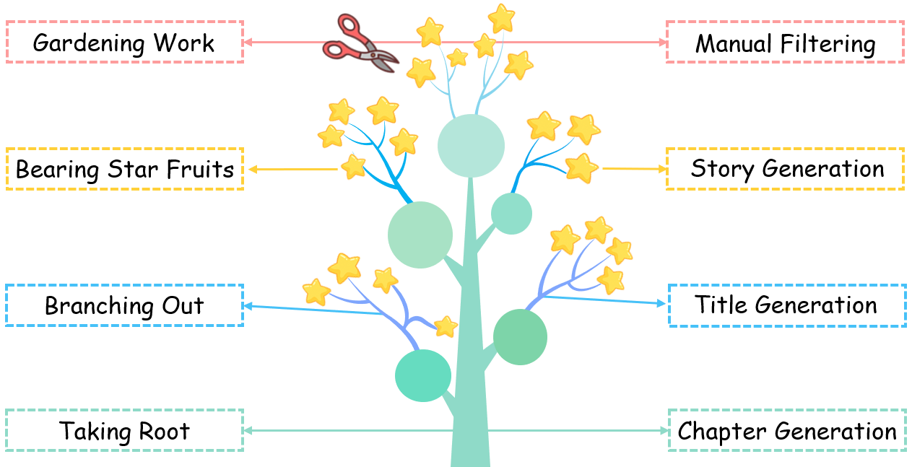

# SS-GEN: A Social Story Generation Framework with Large Language Models (AAAI 2025 Oral)

[](https://arxiv.org/pdf/2406.15695)
[](https://huggingface.co/spaces/BigScience/OpenRAIL)
[](link-to-dataset-if-any)

## 🧠 Introduction

**SS-GEN** is a novel framework for **automated generation of Social Stories™** aimed at helping children with Autism Spectrum Disorder (ASD) better understand and navigate social situations. Social Stories have traditionally been written by psychologists under strict guidelines — however, this process is costly, time-consuming, and lacks diversity.

SS-GEN leverages **Large Language Models (LLMs)** and a custom-designed, constraint-driven strategy (STARSOW) to generate personalized, high-quality Social Stories at scale.

<p align="center">
    

</p>

## 📝 Abstract

> Children with Autism Spectrum Disorder (ASD) often struggle to interpret social cues and engage in daily routines. Social Stories™, designed to improve these abilities, are typically handcrafted by experts, limiting their scalability. To address this, we propose **SS-GEN**, a framework that prompts LLMs to generate constraint-compliant Social Stories using a novel strategy named **STARSOW**. We further curate a high-quality dataset via human filtering and propose a structured evaluation framework. Finally, we fine-tune lightweight open-source models on our dataset, achieving strong results with lower cost and easier deployment. SS-GEN represents a significant step in creating **accessible, affordable, and automated tools** to assist ASD communities.


## 🌳 Framework: STARSOW

The **STARSOW** pipeline includes:
1. **Taking Root**: Generating diverse chapter themes from seed examples.
2. **Branching Out**: Producing multiple Social Story titles under each chapter.
3. **Bearing Star Fruits**: Completing full stories from titles, guided by strict structural and narrative constraints.
4. **Gardening Work**: Rigorous filtering to ensure quality, relevance, and safety.

<p align="center">
    

</p>

## 📊 Dataset

We construct a large-scale Social Story dataset:

| Item | Description |
|------|-------------|
| Chapters | 57 diverse themes |
| Titles in each chapter | >=70 |
| Total stories | 5,085 |
| Avg. chapter length (in words) | 2.46 words |
| Avg. title length (in words) | 5.28 |
| Avg. story content length (in words) | 281.65 |
| Structure | Title + Introduction + Body + Conclusion |
| Constraints | Structural Clarity, Descriptive Orientation, Situational Safety |


### 🧪 Load Dataset via Hugging Face 🤗 (**Recommend**)

```python
from datasets import load_dataset

# Login using e.g. `huggingface-cli login` to access this dataset
ds = load_dataset("FMiMiY/SS-GEN")
```

🔗 [View on Hugging Face](https://huggingface.co/datasets/FMiMiY/SS-GEN)


## 📈 Results

- We fine-tuned several 2B–8B models (e.g., Gemma, Mistral, LLaMA3).
- Fine-tuned models significantly outperformed zero-shot baselines across BLEU, ROUGE, and BERTScore.
- Human evaluation confirmed improvements in **empathy**, **coherence**, and **narrative safety**.

---

## 📁 Repository Structure

```
📂 SS-GEN/
├── SS-GEN Dataset/         # Dataset (Available now)
├── model/                  # Coming soon
├── code /                  # Coming soon
├── README.md
├── Technical Appendix.pdf  # Details includ Prompt templates
└── ...
```


## Citation

If you use SS-GEN or our dataset, please cite:

```bibtex
@article{feng2024ss,
  title={SS-GEN: A Social Story Generation Framework with Large Language Models},
  author={Feng, Yi and Song, Mingyang and Wang, Jiaqi and Chen, Zhuang and Bi, Guanqun and Huang, Minlie and Jing, Liping and Yu, Jian},
  journal={arXiv preprint arXiv:2406.15695},
  year={2024}
}
```


## 🤝 Acknowledgments

This work is supported by Beijing Jiaotong University, Tsinghua University, and Tencent. Special thanks to psychologists, educators, and collaborators who helped shape and evaluate this project.


## 📬 Contact

If you have any questions, suggestions or feedback, feel free to  submmit a issue or contact : 

**Yi Feng** – yifeng@bjtu.edu.cn
